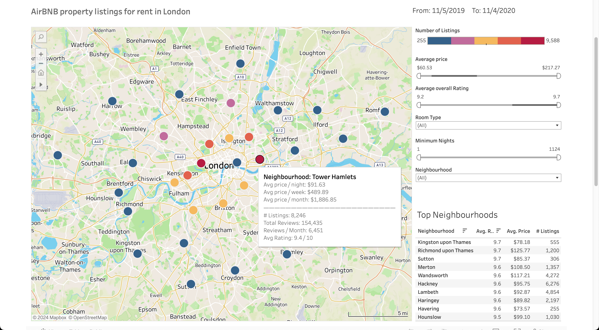

# AirBNB Tableu

The purpose of this learning project is to understand how to work with Tableau Public based on the data provided from Kaggle.

## Data

The datasets were scraped in 2020 and contain detailed listings data, review data and calendar data of Airbnb listings in London.

The files used for dashboard: 

- listings_summary.csv
- calendar.csv
- listings.csv

## Purpose

The main purpose of the dashboard is to show the best neighborhoods and the best listings in each neighborhood.

The overall rating is based on the average of the sub-ratings in the listing (price, comfort, etc.)

## Assumptions

The data provided from Kaggle is not cleaned, I tried to exclude null and not normal values in tableau filters.

Some listings may show a big amount of numbers in overall rating. Unfortunately, it's a bug from Tableau when converting decimal values into string.

To show the top 10 listings and neighborhoods, I wanted to use Multiple Column Ordering (First by rating, and second by price). However, Tableau does not have this functionality like in SQL.

## Tableau Dashboard

You can find the dashboard in [Tableau Public](https://public.tableau.com/views/AirBNBLondon2019/LondonDashboard?:language=en-US&:sid=&:redirect=auth&:display_count=n&:origin=viz_share_link)

